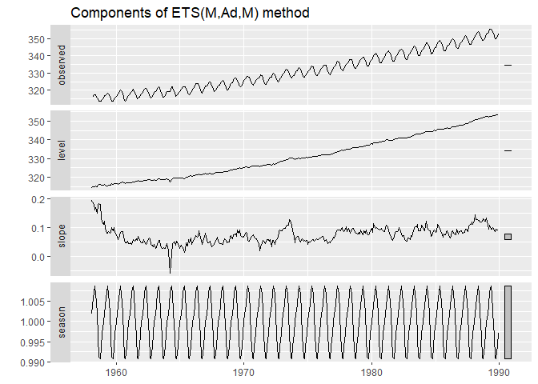
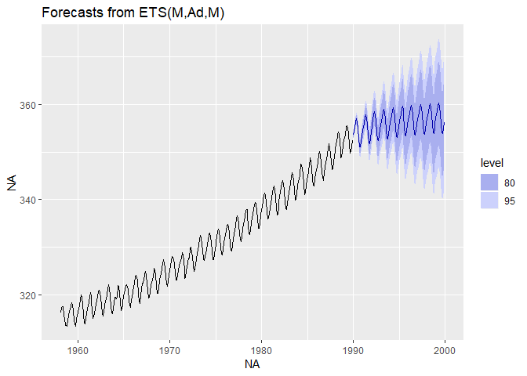
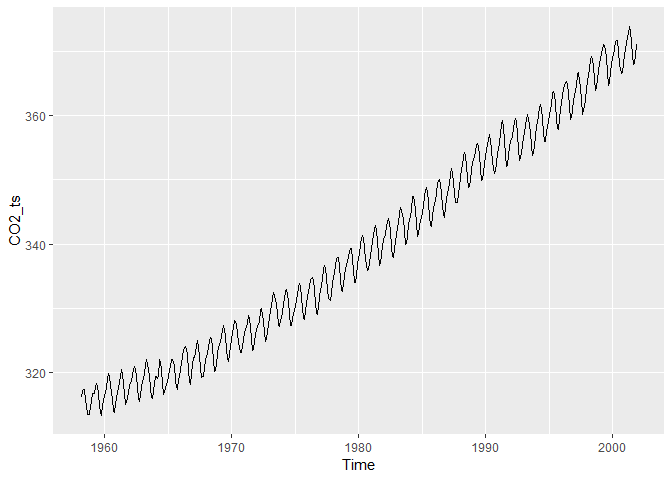
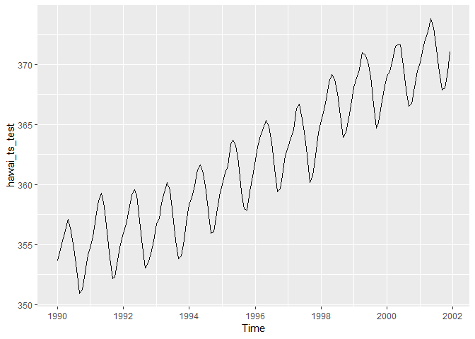
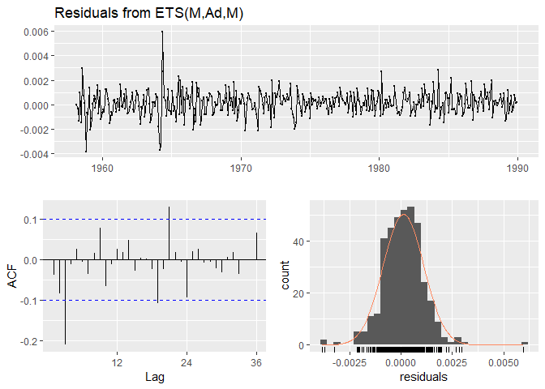
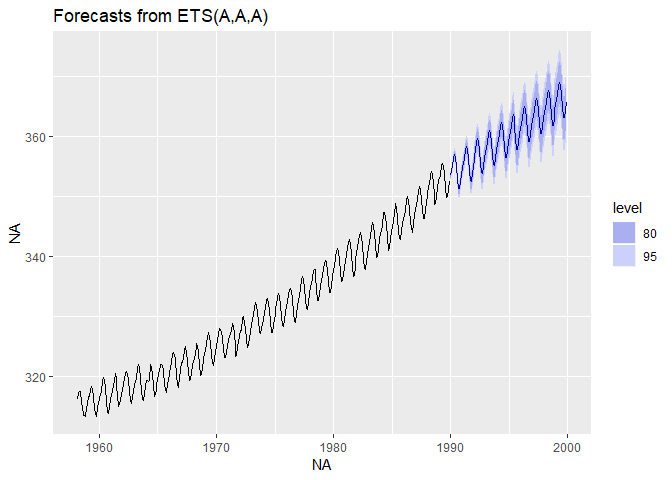

Devoir4
================
Daniel Gouge
2019-04-01

Les séries temporelles
======================

Voici certains modules nécessaires

``` r
library("lubridate")
```

    ## 
    ## Attaching package: 'lubridate'

    ## The following object is masked from 'package:base':
    ## 
    ##     date

``` r
library("forecast")
library("fpp2")
```

    ## Loading required package: ggplot2

    ## Loading required package: fma

    ## Loading required package: expsmooth

Créer la série temporelle
-------------------------

``` r
library("tidyverse")
```

    ## -- Attaching packages ------------------------------------------------------------ tidyverse 1.2.1 --

    ## v tibble  2.1.1       v purrr   0.3.2  
    ## v tidyr   0.8.3       v dplyr   0.8.0.1
    ## v readr   1.3.1       v stringr 1.4.0  
    ## v tibble  2.1.1       v forcats 0.4.0

    ## -- Conflicts --------------------------------------------------------------- tidyverse_conflicts() --
    ## x lubridate::as.difftime() masks base::as.difftime()
    ## x lubridate::date()        masks base::date()
    ## x dplyr::filter()          masks stats::filter()
    ## x lubridate::intersect()   masks base::intersect()
    ## x dplyr::lag()             masks stats::lag()
    ## x lubridate::setdiff()     masks base::setdiff()
    ## x lubridate::union()       masks base::union()

``` r
hawai <- read_csv("data/hawai.csv")
```

    ## Parsed with column specification:
    ## cols(
    ##   Date = col_double(),
    ##   CO2 = col_double()
    ## )

``` r
CO2_ts <- ts(c(hawai$CO2), start = c(1958, 3), frequency = 12)

CO2_ts
```

    ##           Jan      Feb      Mar      Apr      May      Jun      Jul
    ## 1958                   316.1000 317.2000 317.4333 317.4333 315.6250
    ## 1959 315.5000 316.7000 316.7333 317.6750 318.3250 318.0250 316.5250
    ## 1960 316.3800 316.9750 317.5750 319.1200 319.9250 319.4500 318.0600
    ## 1961 316.9250 317.6500 318.5250 319.4200 320.4750 319.7500 318.3200
    ## 1962 317.9250 318.6250 319.6800 320.5500 320.9000 320.5000 319.4250
    ## 1963 318.7250 318.9667 319.8600 321.2750 322.1000 321.4600 319.6000
    ## 1964 319.4000 319.4000 319.1000 319.4000 322.0000 321.7500 320.3000
    ## 1965 319.4000 320.4500 320.9250 322.0000 322.0600 321.7750 321.0400
    ## 1966 320.5400 321.5750 322.3750 323.6600 324.0250 323.7000 322.8500
    ## 1967 322.4000 322.4250 323.0000 324.2800 324.9500 324.0750 322.4800
    ## 1968 322.5500 323.0500 323.9200 324.9750 325.4750 325.2600 324.0250
    ## 1969 323.9250 324.2750 325.6000 326.5750 327.2800 326.5500 325.8000
    ## 1970 325.0800 326.0250 327.0000 328.0750 327.9200 327.5500 326.3000
    ## 1971 326.1400 326.6500 327.2000 327.6750 328.8200 328.4750 327.2200
    ## 1972 326.7200 327.6250 327.7250 329.6400 330.0000 329.0750 328.0400
    ## 1973 328.5500 329.4750 330.3800 331.5750 332.4000 331.9400 330.6500
    ## 1974 329.3250 330.6250 331.5000 332.6250 332.9750 332.1600 331.0750
    ## 1975 330.2500 331.3000 332.0000 333.2750 333.8600 333.4000 331.8000
    ## 1976 331.7400 332.5500 333.4500 334.4500 334.7600 334.4000 332.8600
    ## 1977 332.8800 333.4250 334.7000 336.0400 336.6750 336.2000 334.8000
    ## 1978 335.0250 335.3500 336.6000 337.6400 337.9500 337.9250 336.5000
    ## 1979 336.2250 336.7000 338.0000 338.8750 339.3750 339.2400 337.5250
    ## 1980 337.9250 338.2250 340.0600 340.7500 341.3400 340.9500 339.3750
    ## 1981 339.2200 340.4500 341.4000 342.4500 342.8200 342.1250 340.4250
    ## 1982 340.7000 341.5500 342.6750 343.4750 343.9600 343.3000 341.9200
    ## 1983 341.3400 342.5000 343.1500 344.9000 345.6500 345.2750 343.8200
    ## 1984 343.6750 344.4250 345.1750 347.4000 347.3500 346.6600 345.2000
    ## 1985 344.9250 345.8750 347.4400 348.3250 348.8250 348.1800 346.4500
    ## 1986 346.2500 346.8250 347.7400 349.5250 350.0800 349.3750 347.8250
    ## 1987 348.0000 348.5000 349.4750 350.8500 351.7400 351.1500 349.4500
    ## 1988 350.4000 351.7750 352.1250 353.5800 354.1750 353.7500 352.2200
    ## 1989 352.7750 353.0000 353.6000 355.3600 355.6000 355.1250 353.8600
    ## 1990 353.6500 354.6500 355.4800 356.1750 357.0750 356.0800 354.6750
    ## 1991 354.6750 355.6500 357.2000 358.6000 359.2500 358.1800 356.0500
    ## 1992 355.9000 356.6800 357.9000 359.0750 359.5400 359.1250 357.0000
    ## 1993 356.6800 357.1750 358.4250 359.3250 360.1800 359.5000 357.4200
    ## 1994 358.3200 358.9000 359.9250 361.2200 361.6500 360.9000 359.4600
    ## 1995 359.9750 360.9250 361.5750 363.3600 363.7000 363.2500 361.8000
    ## 1996 362.0250 363.1750 364.0600 364.7000 365.3250 364.8800 363.4750
    ## 1997 363.1250 363.8750 364.5600 366.3250 366.6800 365.4750 364.3750
    ## 1998 365.3400 366.2000 367.3750 368.5250 369.1400 368.7500 367.6000
    ## 1999 368.1200 368.8500 369.6000 370.9750 370.8400 370.2500 369.0000
    ## 2000 369.0200 369.3750 370.4000 371.5400 371.6500 371.6250 369.9400
    ## 2001 370.1750 371.3250 372.0600 372.7750 373.8000 373.0600 371.3000
    ##           Aug      Sep      Oct      Nov      Dec
    ## 1958 314.9500 313.5000 313.5000 313.4250 314.7000
    ## 1959 314.9000 313.8250 313.4000 314.8750 315.5250
    ## 1960 315.7750 314.1750 313.8400 315.0250 316.2000
    ## 1961 316.7750 315.0400 315.3500 316.0500 316.9800
    ## 1962 317.7333 316.0667 315.4750 316.5500 317.5250
    ## 1963 317.6000 316.1500 316.0500 317.0000 318.3500
    ## 1964 318.5000 316.6000 316.9600 317.7250 318.6750
    ## 1965 318.7250 317.8250 317.3400 318.8750 319.3250
    ## 1966 320.2000 318.7000 318.1800 319.9000 321.0600
    ## 1967 320.8500 319.3000 319.4500 320.6750 321.9200
    ## 1968 321.9400 320.2500 320.2750 321.3200 322.9250
    ## 1969 323.5400 322.4000 321.8000 322.8200 324.1250
    ## 1970 324.6600 323.1500 323.1400 324.0500 325.1000
    ## 1971 325.2500 323.4000 323.5400 324.8250 325.9250
    ## 1972 326.2500 324.8600 325.3000 326.4250 327.5400
    ## 1973 329.3250 327.5000 327.2250 328.0500 328.6400
    ## 1974 329.2200 327.3750 327.3750 328.4000 329.6750
    ## 1975 329.9800 328.5250 328.3250 329.4400 330.7750
    ## 1976 330.7250 329.3500 329.1000 330.3500 331.6250
    ## 1977 332.8750 331.5750 331.2000 332.3500 333.8600
    ## 1978 334.6500 332.7400 332.6500 333.8250 334.9600
    ## 1979 336.0250 333.9800 333.9500 335.1500 336.6600
    ## 1980 337.6000 335.8750 336.0250 337.0600 338.2000
    ## 1981 338.4000 336.7000 336.9400 338.4250 339.6000
    ## 1982 339.6250 338.0250 337.9000 339.2750 340.4250
    ## 1983 342.1500 339.8750 340.0200 341.1500 342.9800
    ## 1984 343.3000 341.1200 341.4750 342.8500 344.1400
    ## 1985 344.3000 343.0000 342.8000 344.2200 345.5750
    ## 1986 345.8200 344.8000 344.1000 345.6200 346.8750
    ## 1987 348.0800 346.4000 346.4400 347.9250 348.9250
    ## 1988 350.3000 348.7500 348.9600 350.0000 351.3600
    ## 1989 351.5750 349.8600 350.0500 351.2000 352.4800
    ## 1990 352.9000 350.9400 351.2250 352.7000 354.1400
    ## 1991 353.8600 352.1250 352.2500 353.7400 355.0250
    ## 1992 354.8600 353.0250 353.4200 354.2000 355.3500
    ## 1993 355.3250 353.7750 354.0600 355.3500 356.7750
    ## 1994 357.3750 355.9250 356.0200 357.5750 359.0600
    ## 1995 359.3750 358.0000 357.8500 359.4750 360.7000
    ## 1996 361.3200 359.4000 359.6250 360.7400 362.3750
    ## 1997 362.4600 360.1500 360.7500 362.3800 364.2500
    ## 1998 365.7200 363.9250 364.3200 365.5500 366.9250
    ## 1999 366.7000 364.6750 365.1400 366.6500 367.9000
    ## 2000 367.9500 366.5400 366.7250 368.1250 369.4400
    ## 2001 369.4250 367.8800 368.0500 369.3750 371.0200

Séparer la série en partie d'entraînement et en partie test
-----------------------------------------------------------

Nous cherchons à obtenir un modèle d'autoapprentissage conforme qui sera apte à faire des prédictions fiables. Pour avoir 70% des données en entraînement, nous finirons la partie entraînement en 1989.

``` r
hawai_ts_train <- window(CO2_ts, end = c(1989, 12))

hawai_ts_test <- window(CO2_ts, start = c(1990, 1))    
```

Création d'un premier modèle ETS
--------------------------------

``` r
hawai_model <- ets(hawai_ts_train)

hawai_model
```

    ## ETS(M,Ad,M) 
    ## 
    ## Call:
    ##  ets(y = hawai_ts_train) 
    ## 
    ##   Smoothing parameters:
    ##     alpha = 0.7241 
    ##     beta  = 0.0357 
    ##     gamma = 9e-04 
    ##     phi   = 0.977 
    ## 
    ##   Initial states:
    ##     l = 314.6622 
    ##     b = 0.1933 
    ##     s = 1.0018 0.9999 0.9971 0.9938 0.9908 0.9913
    ##            0.9963 1.0023 1.0068 1.0087 1.0072 1.004
    ## 
    ##   sigma:  0.001
    ## 
    ##      AIC     AICc      BIC 
    ## 1460.930 1462.814 1531.948

``` r
autoplot(hawai_model)
```



On observe ici une tendance à la hausse du niveau de CO2 de 1958 à 1990. Les observations du niveau de CO2 semblent avoir des valeurs qui varient en fonction des saisons à chaque année. La structure des données ne ressemble pas à un bruit blanc. (M,Ad,M) signifie que l'erreur est multiplicative, la tendance est présente et la saison est multiplicative.

Prédiction avec forecast
------------------------

``` r
hawai_ets <- hawai_ts_train %>% ets()
hawai_fc <- hawai_ets %>% forecast(h=12*10)
hawai_fc %>% autoplot() 
```



``` r
summary(hawai_fc)
```

    ## 
    ## Forecast method: ETS(M,Ad,M)
    ## 
    ## Model Information:
    ## ETS(M,Ad,M) 
    ## 
    ## Call:
    ##  ets(y = .) 
    ## 
    ##   Smoothing parameters:
    ##     alpha = 0.7241 
    ##     beta  = 0.0357 
    ##     gamma = 9e-04 
    ##     phi   = 0.977 
    ## 
    ##   Initial states:
    ##     l = 314.6622 
    ##     b = 0.1933 
    ##     s = 1.0018 0.9999 0.9971 0.9938 0.9908 0.9913
    ##            0.9963 1.0023 1.0068 1.0087 1.0072 1.004
    ## 
    ##   sigma:  0.001
    ## 
    ##      AIC     AICc      BIC 
    ## 1460.930 1462.814 1531.948 
    ## 
    ## Error measures:
    ##                      ME      RMSE       MAE        MPE       MAPE
    ## Training set 0.04041742 0.3272724 0.2470216 0.01192918 0.07491171
    ##                   MASE        ACF1
    ## Training set 0.2002344 -0.04225915
    ## 
    ## Forecasts:
    ##          Point Forecast    Lo 80    Hi 80    Lo 95    Hi 95
    ## Jan 1990       353.5520 353.0893 354.0147 352.8444 354.2597
    ## Feb 1990       354.2996 353.7173 354.8818 353.4091 355.1901
    ## Mar 1990       355.1723 354.4816 355.8629 354.1160 356.2285
    ## Apr 1990       356.4088 355.6154 357.2022 355.1954 357.6222
    ## May 1990       357.0028 356.1120 357.8936 355.6405 358.3651
    ## Jun 1990       356.4228 355.4407 357.4049 354.9208 357.9248
    ## Jul 1990       354.9035 353.8353 355.9716 353.2699 356.5370
    ## Aug 1990       352.8755 351.7254 354.0255 351.1165 354.6344
    ## Sep 1990       351.1576 349.9267 352.3885 349.2751 353.0401
    ## Oct 1990       351.0553 349.7393 352.3713 349.0427 353.0679
    ## Nov 1990       352.2148 350.8095 353.6200 350.0656 354.3639
    ## Dec 1990       353.4360 351.9412 354.9307 351.1500 355.7220
    ## Jan 1991       354.5040 352.9202 356.0877 352.0818 356.9261
    ## Feb 1991       355.2313 353.5602 356.9025 352.6756 357.7871
    ## Mar 1991       356.0846 354.3256 357.8437 353.3944 358.7749
    ## Apr 1991       357.3030 355.4541 359.1520 354.4753 360.1308
    ## May 1991       357.8777 355.9420 359.8134 354.9173 360.8381
    ## Jun 1991       357.2760 355.2602 359.2918 354.1930 360.3589
    ## Jul 1991       355.7333 353.6434 357.8231 352.5371 358.9294
    ## Aug 1991       353.6814 351.5215 355.8412 350.3781 356.9846
    ## Sep 1991       351.9410 349.7103 354.1716 348.5295 355.3525
    ## Oct 1991       351.8202 349.5091 354.1313 348.2857 355.3547
    ## Nov 1991       352.9644 350.5646 355.3643 349.2941 356.6347
    ## Dec 1991       354.1707 351.6813 356.6601 350.3635 357.9780
    ## Jan 1992       355.2239 352.6456 357.8022 351.2807 359.1670
    ## Feb 1992       355.9360 353.2712 358.6008 351.8605 360.0114
    ## Mar 1992       356.7746 354.0222 359.5269 352.5652 360.9840
    ## Apr 1992       357.9793 355.1362 360.8223 353.6312 362.3274
    ## May 1992       358.5393 355.6105 361.4681 354.0601 363.0185
    ## Jun 1992       357.9212 354.9165 360.9258 353.3259 362.5164
    ## Jul 1992       356.3608 353.2888 359.4327 351.6626 361.0589
    ## Aug 1992       354.2908 351.1570 357.4246 349.4981 359.0835
    ## Sep 1992       352.5333 349.3361 355.7306 347.6435 357.4232
    ## Oct 1992       352.3987 349.1238 355.6736 347.3902 357.4072
    ## Nov 1992       353.5313 350.1671 356.8955 348.3862 358.6765
    ## Dec 1992       354.7264 351.2720 358.1808 349.4433 360.0095
    ## Jan 1993       355.7683 352.2248 359.3118 350.3490 361.1876
    ## Feb 1993       356.4689 352.8396 360.0981 350.9184 362.0193
    ## Mar 1993       357.2963 353.5800 361.0126 351.6127 362.9799
    ## Apr 1993       358.4907 354.6833 362.2981 352.6677 364.3136
    ## May 1993       359.0397 355.1479 362.9315 353.0877 364.9916
    ## Jun 1993       358.4091 354.4460 362.3722 352.3481 364.4701
    ## Jul 1993       356.8353 352.8121 360.8585 350.6824 362.9883
    ## Aug 1993       354.7517 350.6751 358.8282 348.5172 360.9862
    ## Sep 1993       352.9813 348.8490 357.1137 346.6615 359.3012
    ## Oct 1993       352.8361 348.6297 357.0426 346.4029 359.2694
    ## Nov 1993       353.9600 349.6643 358.2558 347.3903 360.5298
    ## Dec 1993       355.1466 350.7607 359.5325 348.4390 361.8543
    ## Jan 1994       356.1800 351.7055 360.6545 349.3369 363.0231
    ## Feb 1994       356.8718 352.3131 361.4306 349.8998 363.8439
    ## Mar 1994       357.6909 353.0462 362.3356 350.5874 364.7944
    ## Apr 1994       358.8774 354.1419 363.6130 351.6350 366.1199
    ## May 1994       359.4180 354.6001 364.2360 352.0496 366.7865
    ## Jun 1994       358.7781 353.8938 363.6623 351.3083 366.2479
    ## Jul 1994       357.1942 352.2573 362.1311 349.6439 364.7445
    ## Aug 1994       355.1002 350.1188 360.0817 347.4817 362.7187
    ## Sep 1994       353.3201 348.2908 358.3494 345.6284 361.0118
    ## Oct 1994       353.1670 348.0673 358.2666 345.3677 360.9662
    ## Nov 1994       354.2842 349.0960 359.4725 346.3495 362.2190
    ## Dec 1994       355.4644 350.1865 360.7423 347.3925 363.5363
    ## Jan 1995       356.4913 351.1258 361.8569 348.2855 364.6972
    ## Feb 1995       357.1766 351.7286 362.6246 348.8446 365.5086
    ## Mar 1995       357.9893 352.4569 363.5217 349.5282 366.4504
    ## Apr 1995       359.1699 353.5473 364.7925 350.5708 367.7689
    ## May 1995       359.7042 354.0014 365.4069 350.9826 368.4258
    ## Jun 1995       359.0571 353.2933 364.8209 350.2421 367.8721
    ## Jul 1995       357.4656 351.6566 363.2746 348.5815 366.3497
    ## Aug 1995       355.3638 349.5189 361.2086 346.4249 364.3027
    ## Sep 1995       353.5763 347.6915 359.4611 344.5763 362.5763
    ## Oct 1995       353.4171 347.4659 359.3683 344.3156 362.5187
    ## Nov 1995       354.5294 348.4905 360.5683 345.2937 363.7651
    ## Dec 1995       355.7047 349.5769 361.8325 346.3330 365.0764
    ## Jan 1996       356.7268 350.5125 362.9410 347.2229 366.2307
    ## Feb 1996       357.4070 351.1123 363.7018 347.7800 367.0340
    ## Mar 1996       358.2149 351.8374 364.5924 348.4614 367.9684
    ## Apr 1996       359.3911 352.9242 365.8579 349.5009 369.2813
    ## May 1996       359.9206 353.3760 366.4652 349.9114 369.9297
    ## Jun 1996       359.2681 352.6675 365.8687 349.1734 369.3628
    ## Jul 1996       357.6708 351.0324 364.3093 347.5182 367.8235
    ## Aug 1996       355.5631 348.8972 362.2290 345.3685 365.7577
    ## Sep 1996       353.7700 347.0719 360.4682 343.5260 364.0140
    ## Oct 1996       353.6063 346.8456 360.3670 343.2667 363.9459
    ## Nov 1996       354.7148 347.8674 361.5622 344.2426 365.1871
    ## Dec 1996       355.8864 348.9509 362.8219 345.2795 366.4934
    ## Jan 1997       356.9048 349.8840 363.9256 346.1675 367.6422
    ## Feb 1997       357.5813 350.4820 364.6806 346.7238 368.4387
    ## Mar 1997       358.3856 351.2052 365.5659 347.4042 369.3670
    ## Apr 1997       359.5583 352.2895 366.8272 348.4416 370.6751
    ## May 1997       360.0842 352.7399 367.4285 348.8521 371.3164
    ## Jun 1997       359.4277 352.0323 366.8230 348.1175 370.7379
    ## Jul 1997       357.8260 350.3998 365.2523 346.4686 369.1835
    ## Aug 1997       355.7138 348.2682 363.1595 344.3267 367.1009
    ## Sep 1997       353.9166 346.4459 361.3872 342.4912 365.3419
    ## Oct 1997       353.7494 346.2200 361.2788 342.2341 365.2647
    ## Nov 1997       354.8550 347.2398 362.4703 343.2085 366.5015
    ## Dec 1997       356.0239 348.3214 363.7264 344.2439 367.8038
    ## Jan 1998       357.0395 349.2528 364.8261 345.1308 368.9481
    ## Feb 1998       357.7131 349.8498 365.5764 345.6872 369.7389
    ## Mar 1998       358.5146 350.5719 366.4573 346.3672 370.6620
    ## Apr 1998       359.6848 351.6544 367.7152 347.4033 371.9663
    ## May 1998       360.2080 352.1042 368.3117 347.8144 372.6015
    ## Jun 1998       359.5484 351.3983 367.6985 347.0839 372.0129
    ## Jul 1998       357.9434 349.7690 366.1178 345.4417 370.4451
    ## Aug 1998       355.8278 347.6416 364.0140 343.3081 368.3475
    ## Sep 1998       354.0274 345.8231 362.2317 341.4800 366.5747
    ## Oct 1998       353.8576 345.5980 362.1172 341.2256 366.4896
    ## Nov 1998       354.9611 346.6165 363.3056 342.1992 367.7230
    ## Dec 1998       356.1278 347.6967 364.5589 343.2335 369.0221
    ## Jan 1999       357.1413 348.6271 365.6555 344.1199 370.1627
    ## Feb 1999       357.8127 349.2236 366.4019 344.6768 370.9487
    ## Mar 1999       358.6122 349.9451 367.2793 345.3569 371.8674
    ## Apr 1999       359.7804 351.0263 368.5346 346.3922 373.1687
    ## May 1999       360.3015 351.4761 369.1270 346.8042 373.7988
    ## Jun 1999       359.6396 350.7722 368.5071 346.0780 373.2012
    ## Jul 1999       358.0322 349.1466 366.9177 344.4429 371.6215
    ## Aug 1999       355.9140 347.0238 364.8042 342.3177 369.5104
    ## Sep 1999       354.1111 345.2094 363.0129 340.4970 367.7253
    ## Oct 1999       353.9394 344.9855 362.8933 340.2456 367.6332
    ## Nov 1999       355.0412 346.0032 364.0793 341.2187 368.8638
    ## Dec 1999       356.2064 347.0823 365.3304 342.2524 370.1604

``` r
autoplot(CO2_ts)
```



``` r
autoplot(hawai_ts_test)
```



En comparant avec les données "test", on peut voir que la prédition de l'ETS est plutôt bonne par rapport aux variations dans les saisons. Par contre, il semble y avoir une plus grande tendance générale décroissante lorsque nous regardons les données prédites avec l'ETS. La structure des données commence donc à s'affaiser de plus en plus en s'approchant de l'an 2001. Le modèle devient donc de moins en moins fiable à mesure que le temps avance.

Pour comparer davantage, on peut regarder la précision.

``` r
accuracy(hawai_fc, CO2_ts)
```

    ##                      ME      RMSE       MAE        MPE       MAPE
    ## Training set 0.04041742 0.3272724 0.2470216 0.01192918 0.07491171
    ## Test set     4.22348515 5.6339180 4.2405294 1.15932558 1.16413107
    ##                   MASE        ACF1 Theil's U
    ## Training set 0.2002344 -0.04225915        NA
    ## Test set     3.4373506  0.97438878  4.319808

Analyse des résidus
-------------------

``` r
checkresiduals(hawai_ets)
```



    ## 
    ##  Ljung-Box test
    ## 
    ## data:  Residuals from ETS(M,Ad,M)
    ## Q* = 43.204, df = 7, p-value = 3.046e-07
    ## 
    ## Model df: 17.   Total lags used: 24

En premier lieu, on peut observer dans le graphique "Lag" que certaines données dépassent le seuil de confiance d'autocorrélation. Cela signifie qu'il existe une corrélation signidicative dans les données. Nous n'avons probablement pas affaire à un bruit blanc. Les résidues du graphique "residuals" semblent distribués normalement, mais il y a une forte concentration des données vers le 0. Cela pourrait être investigué. On peut aussi voir que certaines données plus extrêmes ont été prises vers l'an 1964. Celles-ci pourraient être aberrantes dépendamment de ce qui explique leur valeur.

Amélioration du modèle
----------------------

On pourrait aussi améliorer le modèle pour une meilleure prédiction à l'aide d'un prétraitement. Par exemple, on pourrait optimiser la valeur de lambda avec la fonction "BoxCox".

``` r
BoxCox.lambda(hawai_ts_train)
```

    ## [1] 0.1127346

``` r
hawai_ets <- hawai_ts_train %>% ets(lambda = 0.1127)
hawai_fc <- hawai_ets %>% forecast(h=12*10)
hawai_fc %>% autoplot() 
```



``` r
summary(hawai_fc)
```

    ## 
    ## Forecast method: ETS(A,A,A)
    ## 
    ## Model Information:
    ## ETS(A,A,A) 
    ## 
    ## Call:
    ##  ets(y = ., lambda = 0.1127) 
    ## 
    ##   Box-Cox transformation: lambda= 0.1127 
    ## 
    ##   Smoothing parameters:
    ##     alpha = 0.6367 
    ##     beta  = 0.0014 
    ##     gamma = 1e-04 
    ## 
    ##   Initial states:
    ##     l = 8.0938 
    ##     b = 6e-04 
    ##     s = 0.0032 -3e-04 -0.0055 -0.0117 -0.0178 -0.0167
    ##            -0.0068 0.0046 0.0132 0.0165 0.0138 0.0075
    ## 
    ##   sigma:  0.0019
    ## 
    ##       AIC      AICc       BIC 
    ## -2496.416 -2494.735 -2429.344 
    ## 
    ## Error measures:
    ##                       ME     RMSE       MAE         MPE       MAPE
    ## Training set 0.009403601 0.318323 0.2403772 0.002424303 0.07290936
    ##                   MASE       ACF1
    ## Training set 0.1948485 0.03741917
    ## 
    ## Forecasts:
    ##          Point Forecast    Lo 80    Hi 80    Lo 95    Hi 95
    ## Jan 1990       353.5080 353.0628 353.9536 352.8273 354.1898
    ## Feb 1990       354.2646 353.7356 354.7943 353.4558 355.0750
    ## Mar 1990       355.1551 354.5528 355.7583 354.2344 356.0780
    ## Apr 1990       356.4148 355.7459 357.0848 355.3922 357.4400
    ## May 1990       357.0352 356.3059 357.7658 355.9204 358.1531
    ## Jun 1990       356.5325 355.7491 357.3175 355.3350 357.7336
    ## Jul 1990       355.0548 354.2229 355.8885 353.7832 356.3305
    ## Aug 1990       353.0822 352.2061 353.9603 351.7430 354.4260
    ## Sep 1990       351.3981 350.4798 352.3185 349.9945 352.8066
    ## Oct 1990       351.3079 350.3460 352.2720 349.8378 352.7834
    ## Nov 1990       352.5173 351.5104 353.5268 350.9783 354.0623
    ## Dec 1990       353.7690 352.7181 354.8226 352.1629 355.3815
    ## Jan 1991       354.8161 353.7229 355.9123 353.1455 356.4938
    ## Feb 1991       355.5752 354.4417 356.7121 353.8429 357.3151
    ## Mar 1991       356.4687 355.2952 357.6455 354.6754 358.2699
    ## Apr 1991       357.7325 356.5189 358.9497 355.8780 359.5955
    ## May 1991       358.3549 357.1039 359.6098 356.4433 360.2756
    ## Jun 1991       357.8506 356.5665 359.1388 355.8884 359.8224
    ## Jul 1991       356.3680 355.0549 357.6855 354.3615 358.3846
    ## Aug 1991       354.3890 353.0495 355.7330 352.3422 356.4463
    ## Sep 1991       352.6993 351.3333 354.0699 350.6122 354.7974
    ## Oct 1991       352.6088 351.2117 354.0108 350.4741 354.7550
    ## Nov 1991       353.8222 352.3899 355.2597 351.6337 356.0228
    ## Dec 1991       355.0780 353.6106 356.5508 352.8360 357.3326
    ## Jan 1992       356.1285 354.6272 357.6355 353.8347 358.4356
    ## Feb 1992       356.8902 355.3563 358.4300 354.5466 359.2474
    ## Mar 1992       357.7865 356.2199 359.3593 355.3930 360.1943
    ## Apr 1992       359.0545 357.4539 360.6614 356.6092 361.5146
    ## May 1992       359.6790 358.0473 361.3172 357.1863 362.1871
    ## Jun 1992       359.1730 357.5152 360.8376 356.6404 361.7215
    ## Jul 1992       357.6856 356.0062 359.3720 355.1200 360.2676
    ## Aug 1992       355.7000 354.0017 357.4056 353.1055 358.3114
    ## Sep 1992       354.0048 352.2868 355.7302 351.3803 356.6466
    ## Oct 1992       353.9140 352.1699 355.6657 351.2497 356.5961
    ## Nov 1992       355.1314 353.3557 356.9150 352.4189 357.8624
    ## Dec 1992       356.3913 354.5839 358.2068 353.6305 359.1712
    ## Jan 1993       357.4453 355.6073 359.2917 354.6378 360.2725
    ## Feb 1993       358.2094 356.3423 360.0852 355.3574 361.0817
    ## Mar 1993       359.1087 357.2120 361.0144 356.2115 362.0268
    ## Apr 1993       360.3808 358.4528 362.3180 357.4359 363.3472
    ## May 1993       361.0073 359.0513 362.9728 358.0196 364.0172
    ## Jun 1993       360.4997 358.5213 362.4879 357.4778 363.5443
    ## Jul 1993       359.0074 357.0117 361.0131 355.9592 362.0788
    ## Aug 1993       357.0154 355.0052 359.0356 353.9452 360.1091
    ## Sep 1993       355.3145 353.2890 357.3504 352.2209 358.4323
    ## Oct 1993       355.2235 353.1747 357.2828 352.0943 358.3772
    ## Nov 1993       356.4449 354.3662 358.5343 353.2702 359.6448
    ## Dec 1993       357.7089 355.6002 359.8287 354.4884 360.9553
    ## Jan 1994       358.7664 356.6287 360.9154 355.5017 362.0576
    ## Feb 1994       359.5330 357.3680 361.7096 356.2266 362.8665
    ## Mar 1994       360.4352 358.2423 362.6401 357.0862 363.8121
    ## Apr 1994       361.7115 359.4886 363.9466 358.3167 365.1348
    ## May 1994       362.3401 360.0908 364.6019 358.9051 365.8042
    ## Jun 1994       361.8308 359.5615 364.1128 358.3653 365.3260
    ## Jul 1994       360.3336 358.0501 362.6301 356.8465 363.8510
    ## Aug 1994       358.3350 356.0404 360.6427 354.8310 361.8697
    ## Sep 1994       356.6286 354.3216 358.9489 353.1058 360.1826
    ## Oct 1994       356.5372 354.2088 358.8792 352.9817 360.1245
    ## Nov 1994       357.7627 355.4052 360.1339 354.1629 361.3949
    ## Dec 1994       359.0308 356.6441 361.4316 355.3864 362.7083
    ## Jan 1995       360.0918 357.6770 362.5209 356.4046 363.8127
    ## Feb 1995       360.8609 358.4199 363.3166 357.1336 364.6226
    ## Mar 1995       361.7661 359.2980 364.2492 357.9975 365.5698
    ## Apr 1995       363.0465 360.5491 365.5593 359.2332 366.8957
    ## May 1995       363.6772 361.1544 366.2156 359.8252 367.5657
    ## Jun 1995       363.1662 360.6252 365.7232 359.2864 367.0832
    ## Jul 1995       361.6641 359.1112 364.2332 357.7662 365.5997
    ## Aug 1995       359.6590 357.0976 362.2367 355.7482 363.6079
    ## Sep 1995       357.9470 355.3756 360.5349 354.0210 361.9116
    ## Oct 1995       357.8553 355.2638 360.4636 353.8986 361.8512
    ## Nov 1995       359.0848 356.4646 361.7220 355.0845 363.1250
    ## Dec 1995       360.3571 357.7080 363.0235 356.3126 364.4422
    ## Jan 1996       361.4215 358.7448 364.1159 357.3350 365.5494
    ## Feb 1996       362.1932 359.4908 364.9135 358.0675 366.3609
    ## Mar 1996       363.1013 360.3724 365.8486 358.9351 367.3103
    ## Apr 1996       364.3860 361.6279 367.1627 360.1754 368.6402
    ## May 1996       365.0187 362.2358 367.8204 360.7703 369.3113
    ## Jun 1996       364.5060 361.7063 367.3250 360.2319 368.8251
    ## Jul 1996       362.9990 360.1893 365.8282 358.7097 367.3338
    ## Aug 1996       360.9873 358.1713 363.8229 356.6885 365.3320
    ## Sep 1996       359.2697 356.4457 362.1136 354.9587 363.6271
    ## Oct 1996       359.1777 356.3345 362.0411 354.8375 363.5650
    ## Nov 1996       360.4112 357.5395 363.3034 356.0275 364.8427
    ## Dec 1996       361.6877 358.7871 364.6091 357.2600 366.1640
    ## Jan 1997       362.7556 359.8276 365.7047 358.2861 367.2745
    ## Feb 1997       363.5298 360.5764 366.5046 359.0216 368.0881
    ## Mar 1997       364.4409 361.4612 367.4424 359.8926 369.0402
    ## Apr 1997       365.7297 362.7209 368.7607 361.1370 370.3742
    ## May 1997       366.3645 363.3313 369.4202 361.7346 371.0469
    ## Jun 1997       365.8502 362.8011 368.9221 361.1961 370.5575
    ## Jul 1997       364.3383 361.2808 367.4187 359.6715 369.0587
    ## Aug 1997       362.3200 359.2582 365.4049 357.6466 367.0474
    ## Sep 1997       360.5968 357.5286 363.6882 355.9138 365.3343
    ## Oct 1997       360.5045 357.4178 363.6147 355.7934 365.2708
    ## Nov 1997       361.7420 358.6268 364.8812 356.9873 366.5528
    ## Dec 1997       363.0226 359.8784 366.1912 358.2238 367.8785
    ## Jan 1998       364.0940 360.9224 367.2904 359.2533 368.9925
    ## Feb 1998       364.8708 361.6739 368.0927 359.9917 369.8085
    ## Mar 1998       365.7849 362.5617 369.0334 360.8657 370.7635
    ## Apr 1998       367.0779 363.8255 370.3562 362.1141 372.1021
    ## May 1998       367.7148 364.4381 371.0176 362.7141 372.7766
    ## Jun 1998       367.1988 363.9071 370.5169 362.1752 372.2841
    ## Jul 1998       365.6819 362.3833 369.0072 360.6478 370.7783
    ## Aug 1998       363.6570 360.3558 366.9851 358.6190 368.7578
    ## Sep 1998       361.9282 358.6221 365.2612 356.8829 367.0366
    ## Oct 1998       361.8356 358.5116 365.1869 356.7630 366.9721
    ## Nov 1998       363.0771 359.7243 366.4576 357.9606 368.2585
    ## Dec 1998       364.3620 360.9799 367.7721 359.2008 369.5888
    ## Jan 1999       365.4369 362.0272 368.8750 360.2337 370.7066
    ## Feb 1999       366.2161 362.7813 369.6798 360.9746 371.5251
    ## Mar 1999       367.1332 363.6720 370.6237 361.8515 372.4833
    ## Apr 1999       368.4305 364.9397 371.9509 363.1037 373.8266
    ## May 1999       369.0695 365.5545 372.6144 363.7059 374.5031
    ## Jun 1999       368.5518 365.0226 372.1113 363.1665 374.0079
    ## Jul 1999       367.0300 363.4951 370.5953 361.6361 372.4951
    ## Aug 1999       364.9984 361.4625 368.5650 359.6030 370.4656
    ## Sep 1999       363.2639 359.7245 366.8341 357.8633 368.7367
    ## Oct 1999       363.1710 359.6142 366.7590 357.7438 368.6711
    ## Nov 1999       364.4166 360.8306 368.0342 358.9450 369.9621
    ## Dec 1999       365.7057 362.0901 369.3533 360.1889 371.2973

Le résultat est déjà mieux, car on observe beaucoup moins "d'affaissement" du modèle ETS précédent. Le ETS devient alors (AAA), donc une erreur aditive, une tendance présente et la saison aditive, ce qui semble correspondre au jeu de donnée entier.
